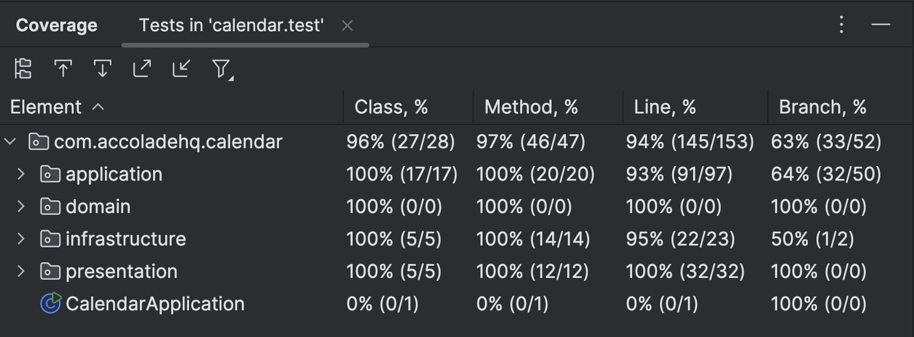

## Calendar Booking System
Built using Spring Boot, Java, and Gradle. The system uses h2 in-memory database with postgresql dialect for development and testing purposes.

### Assumptions
1. Time slot of 23:00 to 00:00 (next day) is not being considered for simplicity.
    - this means user can create availability rule for 00:00 to 23:00 on a given day.
    - and also can book appointment between this time range.
2. User can create multiple availability rules for a given day with overlapping time slots.
    - e.g. user can create availability rule for 9AM to 12AM and 10AM to 2PM on a given day.
    - I have incorporated this flexibility by observing cal.com availability rules.
3. By default, two users have been populated using `src/main/resources/data.sql` file.
    - You can use these users to test the application.
    - You can modify this file to add more users or change existing ones.
4. The `User` Entity in the application refers to the schedule owner, i.e. the person who has availability rules set up.
    - The `Attendee` is the person who books an appointment against the schedule owner's availability. and does not need to have any user creds in the system.

## Setup and Running Instructions

### Prerequisites
- Java 17 or higher installed
- Gradle installed (or use the Gradle wrapper)

### Build and Run
1. Clone the repository:
   ```bash
   git clone <repository-url>
   cd calendar
   ```
2. Build the project:
   ```bash
   ./gradlew build
   ```
3. Run the application:
   ```bash
   ./gradlew bootRun
   ```
   or
   ```bash
   java -jar build/libs/calendar-0.0.1-SNAPSHOT.jar
   ```

The application will start on `http://localhost:8080` by default.

### API Documentation
API documentation is available at `http://localhost:8080/docs`. The documentation has been generated using `Swagger`

### Testing
To run tests:
```bash
./gradlew test
```



### API Endpoints
Refer to this [Postman Collection](https://documenter.getpostman.com/view/20218768/2sB3BEnVfJ) for examples of API requests and responses.
1. `POST /api/appointments/book` - Book an appointment against an available slot of the schedule owner. you will pass the owner id (`ownerId`) in the request body. 
2. `GET /api/appointments` - Endpoint enabling schedule owner to view all the upcoming appointments. pass the owner id (`uid`) as header
3. `POST /api/availability` - Schedule owner can create an availability rule using this endpoing. pass the owner id (`uid`) as header
4. `GET /api/availability` - Get all available slots of the schedule owner. pass the owner id (`uid`) as header

## Feature Breakdown
### UseCases
**Owner**
1. owner can set availability
2. owner can view the appointments made with him/her

**Attendee**
1. user can search available slots for a given owner on a specific date
2. user can book an appointment against an available slot

### Domain entities
1. User
2. Appointment - MON - 9AM - 10AM
3. AvailabilityRule - Mon - 9AM - 5PM

### Domain Model

**User**
- id
- name
- email - unique for each user

**Appointment**
- id
- userId
- inviteeEmail
- inviteeName
- startTime
- endTime

**AvailabilityRule**
- id
- userId
- weekday
- startTime
- endTime
